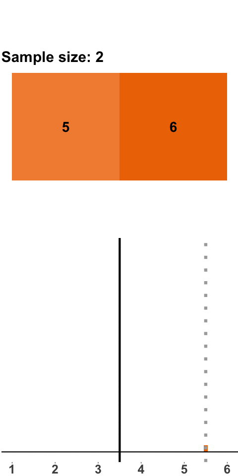
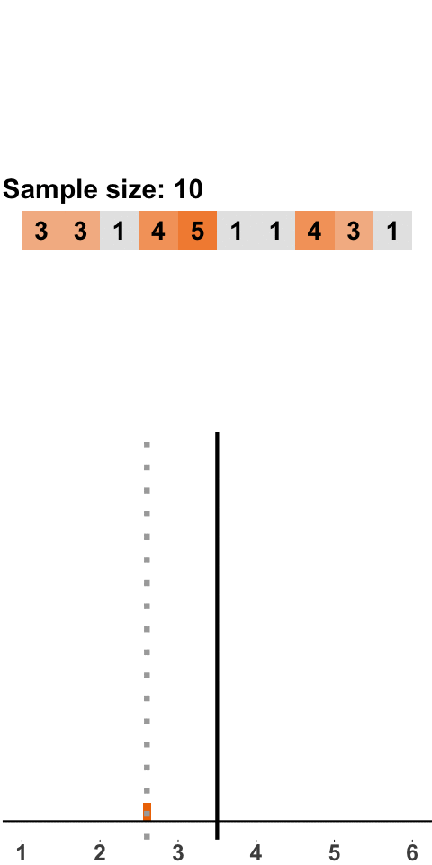

--- 
title: "Course Webpage ECON30130 ECONOMETRICS"
author: "Benjamin Elsner"
date: "`r Sys.Date()`"
site: bookdown::bookdown_site
documentclass: book
bibliography: [book.bib, packages.bib]
# url: your book url like https://bookdown.org/yihui/bookdown
# cover-image: path to the social sharing image like images/cover.jpg
link-citations: yes
github-repo: rstudio/bookdown-demo
output:
  bookdown::gitbook:
    highlight: espresso
    css: "style.css"
    toc_depth: 2
---

```{r setup, include=FALSE, warning=FALSE, message=FALSE}
knitr::opts_chunk$set(echo = TRUE, warning = FALSE, message=FALSE)
library(dplyr)
library(ggplot2)
library(reshape2)
library(RColorBrewer)
library(wesanderson)
```


```{r basicfunctions, include=FALSE}
diceroll <- function(n){
  dice <- sample(1:6, size = n, replace = TRUE)
  return(dice)
}
```


# Preface {-}

This is a companion webpage for the course ECON30130 Econometrics at University College Dublin (UCD). The website provides students with the opportunity to explore and deepen their knowledge of some of the key concepts covered in the course. I will work a lot with visualisations and dashboards, which should help students to develop intuition about econometric techniques. 
The webpage is a complement to and not a substitute for the textbook, lecture slides or lecture attendance. 

Some key concepts have been explained and visualised much better by other econometrics and statistics teachers. At various parts of the text, I will provide links to relevant webpages. In particular, I recommend the following online textbooks:

- [**Introduction to Econometrics with R**](https://www.econometrics-with-r.org/) by Christoph Hanck, Martin Arnold, Alexander Gerber and Martin Schmelzer of the University of Duisburg-Essen (Germany). This online textbook teaches R based on the Stock & Watson textbook and provides a wealth of examples and exercises. 
-[ **Introduction to Econometrics with R**](https://scpoecon.github.io/ScPoEconometrics/) by Florian Oswald, Vincent Viers, Jean-Marc Robin, Pierre Villedieu and Gustave Kenedi of SciencesPo in Paris. These teachers (who are also great researchers btw) created a standalone course in econometrics. All teaching is through R. The textbook contains lots of examples while often going into great detail. 
- For basics of statistics and data science, I highly recommend [**Telling Stories with Data**](https://tellingstorieswithdata.com/) by Rohan Alexander. It covers a lot of basic tasks such as collecting, cleaning, storing and visualising data. 


The website has been created by Benjamin Elsner. For any feedback, please email benjamin(dot)elsner(at)ucd.ie. 


# Statistics Refresher

This chapter covers statistical concepts that are central in any statistical analysis. We will use the example of dice rolls to develop an intuition for these concepts. 


## Lingo: Estimators, Estimates and all that

In most (if not all) statistical analyses, we want to learn something about a **population of interest**. The population of interest does not need to be the actual population of a country or the world, but it can also be a very specific population such as all students in this course, all people below age 25, all countries (or only those with a GDP less than 20k€), etc. However, using the entire population for an analysis is usually not practical and often impossible. For example, if you were to do a blood test with the entire population -- all the blood in a patient's body -- you would get the best possible information about the population of interest, but you can also be sure that the patient won't survive the test. For this reason, blood tests are based on a small sample of blood. As we will learn, much can be learned from relatively small samples about the population. 

Within the population of interest, we are typically interested in a particular statistic -- which is sometimes called **target parameter** or **quantity of interest** or **population statistic** or **estimand**. Your doctor wants to know the concentration of certain biomarkers in all your blood cells. As a policy analyst, we want to know the impact of childcare subsidies on child development, etc. These are examples of population statistics we are interested in. 

If our analysis is based on a sample rather than the population, we say that we **estimate** these population statistics. This means that we compute the same statistic in our sample. The procedure we use to do this is called **estimator** and the result, i.e. the statistic computed from the sample, is called **estimate**. Once we obtained an estimate, we use insights from statistics to assess how much we can learn from this estimate about the population statistic we are interested in. 

For example, we may be interested in the population mean $\mu_Y$. We can draw a random sample of size $n$ from the population and estimate the population mean using the formula for the sample mean,

\begin{equation}
\overline{Y}=\frac{1}{n}\displaystyle\sum_{i=1}^n Y_i. 
(\#eq:mean)
\end{equation}

The formula in Equation (\ref@(eq:mean)) is the **estimator** for the population mean $\mu_Y$. If we apply the estimator to a __particular__ sample $s$, we obtain an **estimate** $\overline{Y_s}$for the sample $s$. If we were to draw another sample $t \neq s$, we use the same estimator but obtain a different estimate $\overline{Y_t}$. 


:::: {.blackbox data-latex=""}
::: {.center data-latex=""}
**Definition: Estimator and Estimate**
:::
An **estimator** is a procedure that is used for calculating an estimate for a quantity of of interest based on a sample from the population of interest.  

**In plain English**: An estimator is to an estimate what a recipe is to a cake. Suppose we want to bake a chocolate cake (that's the quantity, or in that case rather the object of interest). We then use recipe that tells us how we convert the ingredients into a chocolate cake. The recipe is the equivalent of the estimator. When we do this, we hopefully get a tasty chocolate cake, which is the estimate. But every time we do this, we get a cake that tastes slightly different. It's the same with estimators. Not that we know what they taste like, but we get a different estimate every time we apply the same estimator to a different sample. 
::::


## The Sampling Distribution

The sampling distribution is central to any statistical analysis. After all, we typically cannot analyse the entire population of interest but have to draw inference from a smaller random sample. As we will see, there is a lot that can be learned about the population even from a medium-sized random sample. However, an analysis that is based on random sampling comes with the challenge that every random sample will yield different estimates. Suppose we wanted to estimate the mean height of students at UCD. If we draw five students at random and calculate the mean height of these students, we may end up with an estimate that is larger than the true mean -- if we happen to disproportionately sample taller students -- or smaller than the true mean -- if we happen to disproportionately sample shorter students. If we draw many such samples and compute the mean in each sample, we will likely get a different mean height in each sample. **The distribution of these means is called the sampling distribution.** 

:::: {.blackbox data-latex=""}
::: {.center data-latex=""}
**Definition: Sampling Distribution**
:::
**Wikipedia says**: _A sampling distribution or finite-sample distribution is the probability distribution of a given random-sample-based statistic._

**In plain English**: Suppose we draw many random samples and in each sample we compute the same statistic (for example the mean, variance, minimum or maximum). The distribution of these statistics across all samples is called the sampling distribution. 
::::


When students encounter the sampling distribution for the first time, they tend to struggle with this concept. To illustrate what the sampling distribution is, where it comes from and what it is useful for, we will consider **dice rolls**. If we have a fair dice, the **expected number of points is 3.5**. This is the case because each side comes up with a probability of $1/6$, and thus **the (population) mean is**

\begin{equation*}
\mu_Y=\frac{1}{6}\times \left(1 + 2 + 3 + 4 + 5 + 6\right)=3.5.
\end{equation*}

This mean is what we will get if we roll a dice an infinite number of times and calculate the mean across all rolls. But that's a theoretical quantity. No one can actually roll a dice so many times. The real question here is what happens if we roll a dice a finite number of times and take the mean. 

### Sampling distribution in very small samples {-}

Let's start with a small sample size: we roll two dice, compute the mean, roll two dice, compute the mean, and so on. Figure \@ref(fig:diceroll2) shows the result of this exercise with 200 samples (i.e. 200 times we roll two dice and compute the mean). The orange panels at the top show the points of the two dice. With every sample of size two, we add a new mean to the distribution shown in the panel at the bottom (the grey line highlights where in the distribution the new mean falls). 


```{r diceroll2, out.width = '40%', echo=FALSE, fig.align="center", fig.cap="Sampling Distribution: Two Dice Rolls per Sample"}
 
```

The distribution that emerges -- the sampling distribution -- is quite interesting. The distribution seems to be fairly symmetric around the population mean of 3.5, and there are more samples with means between 2 and 4 and fewer with means smaller than 2 or larger than 4. This distribution should not come as a surprise because there are more combinations that yield a sample mean of 3.5 -- $\{3,4\}$, $\{2,5\}$, $\{1,6\}$ all yield a sample mean of 3.5, whereas a sample mean of 1 can only occur with the combination $\{1,1\}$. 

### Sampling distribution in larger samples {-} 

Now consider slightly larger samples. In Figure \@ref(fig:diceroll10) the sample size is ten dice rolls. 


```{r diceroll10, out.width = '40%', echo=FALSE, fig.align="center", fig.cap="Sampling Distribution: 10 Dice Rolls per Sample"}

```


As was the case with samples of two dice rolls, we get a sampling distribution that is roughly symmetric around 3.5 and has a bell shape. What is different is that the distribution is a lot tighter around 3.5, which means that there are fewer extreme values than with samples of two dice. This should not be surprising. Consider a sample mean of 1, which only occurs if all dice yield one point. When we roll two dice, it is a lot more likely to have all ones than when we roll ten dice. 

In Figure \@ref(fig:diceroll100) we go even further and roll 100 dice at a time. Think about this like us pouring a bucket with 100 dice on the floor, calculating the mean, putting the dice back into the bucket, and starting again. Luckily, we can do this on a computer and don't have to waste our time returning dice to a bucket. 


```{r diceroll100, out.width = '40%', echo=FALSE, fig.align="center", fig.cap="Sampling Distribution: 100 Dice Rolls per Sample"}
knitr::include_graphics('_bookdown_files/diceroll100.gif')
```

Again, the same picture emerges, namely a bell-shaped sampling distribution that is centered on the population mean of 3.5. With a sample size of 100, almost all samples have a mean close to 3.5. 
And if we were to increase the sample size even further, the sampling distribution would be even tighter around the population mean of 3.5. 


```{r hist_sampling_code, echo=FALSE, include=FALSE} 
set.seed(8882)
nrsamples <- 200

dicemean <- function(samplesize, nrsamples){
  dicedata = as.data.frame(matrix(nrow=samplesize*nrsamples,ncol=2))
  colnames(dicedata) <- c("sample", "value")
  for(i in 1:nrsamples){
    for(j in 1:samplesize){
    dicedata$sample[(i-1)*samplesize+j]=i
    dicedata$value[(i-1)*samplesize+j]=diceroll(1)
    }
  } 
  dicemeans <- dicedata %>% group_by(sample) %>% summarise(mean(value))
  return(dicemeans)
}


histdata2 <- dicemean(2, nrsamples)
histdata10 <- dicemean(10, nrsamples)
histdata100 <- dicemean(100, nrsamples)

a <- as.data.frame(cbind(histdata2[,2], histdata10[,2], histdata100[,2]))
colnames(a) <- c("roll2", "roll10", "roll100")
histdata <- melt(a)

dens_sampling <- ggplot(histdata, aes(x=value, y=..density..)) +
  geom_density(aes(fill=factor(variable)), alpha=0.25) +
  scale_fill_brewer(palette="YlOrRd", labels = c("2", "10", "100")) + 
  guides(fill = guide_legend(title = "Sample size")) +
  #scale_fill_hue(labels = c("2", "10", "100")) +
  geom_vline(aes(xintercept = 3.5), size=1, colour="black", linetype="dotted")+ 
  scale_x_continuous(breaks = seq(1, 6, 1), lim = c(1,6))+
    theme(axis.text.y=element_blank(),
        axis.title.x=element_blank(),
        axis.title.y=element_blank(),
        axis.ticks.y = element_blank(),
        axis.text.x = element_text(face="bold", size=15),
        panel.grid.major = element_blank(),
        panel.grid.minor = element_blank(),
        panel.border = element_blank(),
        panel.background = element_blank(),
        plot.margin=margin(0, 0, 0, 0,"cm")) +
  geom_hline(yintercept = 0, size=1)


```


```{r histsampling, echo=FALSE, fig.align="center", fig.cap="Sampling Distribution of Means (2, 10, 100 dice rolls, 200 samples each)"}
dens_sampling
```


In Figure \@ref(fig:histsampling), we can see the histograms of the three sampling distributions. The center of all distributions is close to the expected value of $3.5$. The distribution of the smallest sample size (2 dice rolls) is very wide whereas the distribution of samples with 100 dice rolls is fairly tight. 


:::: {.blackbox data-latex=""}
::: {.center data-latex=""}
**Key Observation**
:::
**As the sample size $n$ increases**

- the _mean of each sample_ gets _closer to the expected value_ of $3.5$
- the _sampling distribution_ of the means becomes tighter around the expected value of $3.5$

::: {.center data-latex=""}
**Explanation**
:::

With a _small sample size $n$_, any particular sample may be very different from the population (where each side of the dice is equally likely to occur). We may have samples with only ones or only sixes.
As the _sample size $n$ increases_ each individual sample looks more and more similar to the population and, thus, the sample mean becomes more similar to the population mean. This means that **if we have a larger sample, we can be more confident** that this sample can teach us something about the population.
::::

$$\\[0.3cm]$$

The question is when is a sample _large enough_? The answer to this question unfortunately is _it depends_. We will later learn that samples greater than $30$ tend to have favourable properties, but in empirical applications we would need much greater samples than that.


## The Law of Large Numbers and Consistency of an Estimator


What we observed in Figure \@ref(fig:histsampling) is the result of the **Law of Large Numbers (LLN)**. According to the LLN, if we take an infinite number of random samples and take the sample mean $\overline{Y}$ in each sample, then the average of all sample means, $E(\overline{Y})$ converges to the true population mean $\mu_Y$. 

We can see this in Figure \@ref(fig:histsampling). Even with 200 small samples of size 2, the mean of the distribution is close to 3.5. If we were to draw more samples, it would get even closer to the population mean of 3.5. The LLN also implies that as the sample size $n$ increases, each sample mean has a higher probability of being close to the population mean $\mu_Y$. We can see this in Figure \@ref(fig:histsampling): the larger $n$ is, the tigther is the distribution around the population mean of 3.5. If the sample was infinitely large, the distribution would collapse onto the vertical line at the population mean of 3.5.

```{r llngraph, out.width = '50%', echo=FALSE, fig.align="center", fig.cap="Illustration of the LLN"}
knitr::include_graphics('_bookdown_files/lln.gif')
```

Figure \@ref(fig:llngraph) illustrates the LLN based on dice rolls with sample sizes 2, 10, 50, 100 and 1000. Each dot is a sample mean, and if two samples have a similar mean we draw dots next to each other. For each sample size, we draw 200 samples. Again, we can make two observations that reflect the LLN: 

- no matter what the sample size is, the mean of the distribution is close to the population mean (grey line). You can see this because all distributions are roughly symmetric around 3.5.
- As the sample size gets larger, the individual sample means are getting closer to the population mean. 


<!--
## Unbiasedness and Consistency of an Estimator

Both results of the LLN are key ingredients for two (desirable) properties of estimators: these are **unbiasedness** and **consistency**.


The latter result -- that sample means converge to the population mean as $n$ gets larger -- is a key ingredient for consistency 


## The Central Limit Theorem


# Linear Regression


# Statistical Inference


# Multiple Regression -->


<!--
# About

This is a _sample_ book written in **Markdown**. You can use anything that Pandoc's Markdown supports; for example, a math equation $a^2 + b^2 = c^2$.

## Usage 

Each **bookdown** chapter is an .Rmd file, and each .Rmd file can contain one (and only one) chapter. A chapter *must* start with a first-level heading: `# A good chapter`, and can contain one (and only one) first-level heading.

Use second-level and higher headings within chapters like: `## A short section` or `### An even shorter section`.

The `index.Rmd` file is required, and is also your first book chapter. It will be the homepage when you render the book.

## Render book

You can render the HTML version of this example book without changing anything:

1. Find the **Build** pane in the RStudio IDE, and

1. Click on **Build Book**, then select your output format, or select "All formats" if you'd like to use multiple formats from the same book source files.

Or build the book from the R console:

```{r, eval=FALSE}
bookdown::render_book()
```

To render this example to PDF as a `bookdown::pdf_book`, you'll need to install XeLaTeX. You are recommended to install TinyTeX (which includes XeLaTeX): <https://yihui.org/tinytex/>.

## Preview book

As you work, you may start a local server to live preview this HTML book. This preview will update as you edit the book when you save individual .Rmd files. You can start the server in a work session by using the RStudio add-in "Preview book", or from the R console:

```{r eval=FALSE}
bookdown::serve_book()
```

-->

```{r include=FALSE}
# automatically create a bib database for R packages
knitr::write_bib(c(
  .packages(), 'bookdown', 'knitr', 'rmarkdown'
), 'packages.bib')
```
